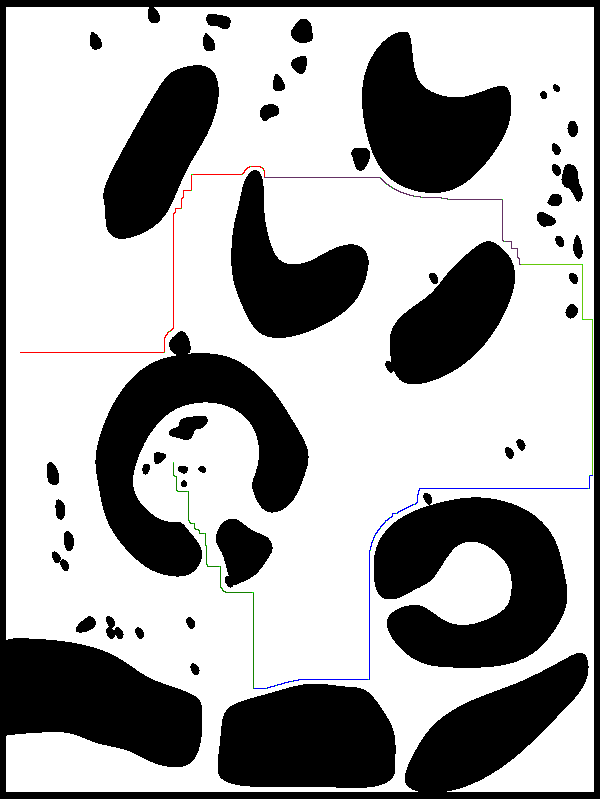
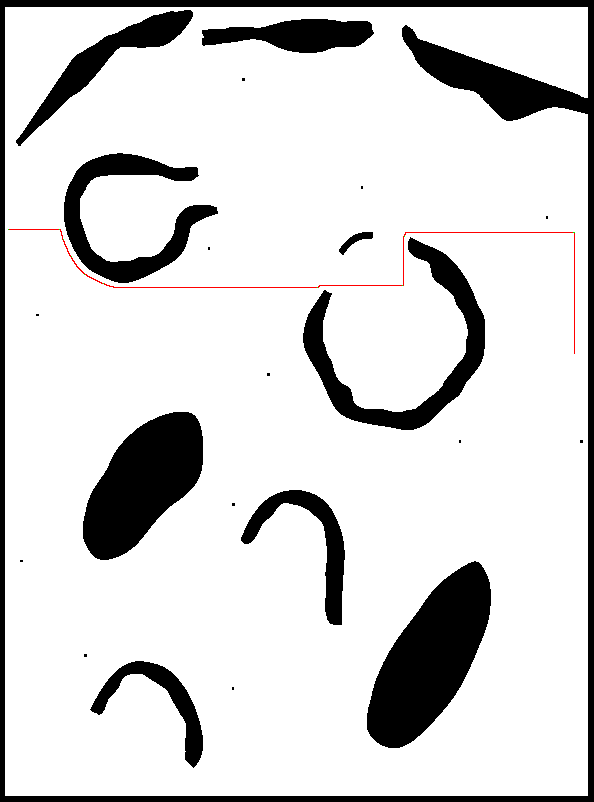

# motion_control

## ERC 3rd Test Drive Preplaned Route
This is the Robocol team's planned approach for the third test drive of the European Rover Challenge 2021.


The image above is the preplanned path for the test drive. It was generated using an A* path planning algorithm built in python, which we might also use during the test. We built it taking into account the given waypoints on the marsyard.
Our plan is to make leo rover follow this path semi-autonomously using ROS nodes for monitoring, teleoperation and autonomous navigation. In the case we find an unforeseen obstacle, we will switch to teleoperated navigation. We will also constantly pusblish an image of the marsyard with the planned path and the current estimated pose of the rover.  
The path goes as it follows:  
starting point ->  waypoint 1 ->  waypoint 2 ->  waypoint 3 -> waypoint 4 -> waypoint 5B
## Overview
This is a ROS workspace made for autonomous navigation and teleoperation of the leo rover, for the ERC 2021.

**Keywords:** ROS, ERC_2021, python

### License

The source code is released for use at Robocol.

**Author: motion control and power subsystems<br />
Affiliation: [Robocol](https://robocol.uniandes.edu.co/es/)<br />
Maintainer: Motion control team at Robocol, robocol@uniandes.edu.co

The motion_control_pkg package has been tested under [ROS] Melodic on Ubuntu 18.04.
For optimal performance, running a partition with Ubuntu on your machine is recommended, however, a virtual machine is still a good option. 
This is development code, expect continous changes and improvements. 





## Installation

### Building from Source
The package has been made to work with the ERC-Remote-Navigation-Sim package.
In order for it to work, you must check their repository [here](https://github.com/EuropeanRoverChallenge/ERC-Remote-Navigation-Sim/tree/master) and follow their instructions for building and launching the marsyard simulation. We recomend you build this workspace at ~ in your machine.

#### Dependencies
- python3 (you probably already have this with your ubuntu and ROS installation)
- [Robot Operating System (ROS)](http://wiki.ros.org) (middleware for robotics)
- use pip3 install [module] or python3 -m pip install [module] to install the following modules
```bash
pip3 install opencv-python matplotlib rospkg pynput
```


*Troubleshooting
Pip install [opencv-python](https://pypi.org/project/opencv-python/) fails with ModuleNotFoundError: No module named 'skbuild':
your pip version must be >= 19.3. Please upgrade pip with pip install --upgrade pip.

#### Building

1. Clone the repository (recommended location is ~).

  ```bash
  cd ~
  ```

  ```bash
  git clone https://github.com/robocol-rem-u/motion_control.git
  ```

2. Move to the root of the workspace.

  ```bash
  cd ~/motion_control
  ```

3. Build the workspace

  ```bash
  catkin build
  source devel/setup.bash
  ```

4. In a new tab (Ctrl+Shift+t) run _roscore_

  ```bash
  roscore
  ```

5. Run the desired node in your previous tab.

  ### Planning node
  ```bash
  rosrun motion_control_pkg planeacion_a.py
  ```
### Running in Docker

Docker is a great way to run an application with all dependencies and libraries bundles together. 
Make sure to [install Docker](https://docs.docker.com/get-docker/) first. 

#### Build image from Dockerfile
---
**NOTE**
If you are using docker on linux, make sure to run the docker commands with sudo. Or, you can configure docker to work without root permisions [here](https://docs.docker.com/engine/install/linux-postinstall/).

It is NOT recommended to build the image from windows, since issues can arise due to file format incompatibility. Working on a *nix system (linux, macos) is recommended.

---
cd to your working repository, then run docker build to create an image named erc.
```bash
cd ~/motion_control
docker build -t erc .
```
spin up a container named motion-container from the image
```bash
docker run -it --name motion-container erc
```
to start a new terminal inside the container, on a new terminal on your host run:
```bash
docker exec -it motion-container bash
```
Now let's try to run a node. 
```bash
source devel/setup.bash
roscore
```
On a new terminal (inside the container)
```bash
source devel/setup.bash
rosrun motion_control_pkg planeacion_a.py 
```
If you wish, you can echo the route topic:
```bash
source devel/setup.bash
rostopic echo /Robocol/MotionControl/ruta 
```
Finally, publish to the topic
```bash
rostopic pub -1 /Robocol/Inicio_fin geometry_msgs/PoseArray "header:
  seq: 0
  stamp:
    secs: 0
    nsecs: 0
  frame_id: ''
poses:
- position:
    x: 0.0
    y: 0.0
    z: 0.0
  orientation:
    x: 0.0
    y: 0.0
    z: 0.0
    w: 0.0
- position:
    x: 5.0
    y: 0.0
    z: 0.0
  orientation:
    x: 0.0
    y: 0.0
    z: 0.0
    w: 0.0"
```
You should see an output on the node and the route topic.
## Usage
In order to create a path given two points in a map, send the coordinates to the control node and have the rover move autonomously towards a goal, follow these steps:

Begin by going to your ERC working directory and launching the marsyard simulation
```bash
cd ~/ERC-Remote-Navigation-Sim/
source devel/setup.bash
roslaunch leo_erc_gazebo leo_marsyard.launch
```
A new gazebo window should appear, and the ROS master should now be running.
Now lets run the necessary nodes from the motion control package:
```bash
cd ~/motion_control/
source devel/setup.bash
```
run the following nodes. Remember to run each one on its own terminal and to source the workspace each time.
```bash
rosrun motion_control_pkg planeacion_a.py
```
```bash
rosrun motion_control_pkg teclado.py 
```
```bash
rosrun motion_control_pkg control_simV2.py
```
optionaly, you can echo the /Robocol/Inicio_fin topic, to make sure it's working correctly
```bash
rostopic echo /Robocol/Inicio_fin
```
Now that all the required nodes are running, let's publish a message to create a path:
```bash
rostopic pub -1 /Robocol/Inicio_fin geometry_msgs/PoseArray "header:
  seq: 0
  stamp:
    secs: 0
    nsecs: 0
  frame_id: ''
poses:
- position:
    x: 0.0
    y: 0.0
    z: 0.0
  orientation:
    x: 0.0
    y: 0.0
    z: 0.0
    w: 0.0
- position:
    x: 5.0
    y: 0.0
    z: 0.0
  orientation:
    x: 0.0
    y: 0.0
    z: 0.0
    w: 0.0"
```
Chech the echo terminal, it should display the same message you just published. 
Then check the terminal running the planeacion_a.py node, it should display an array of points, this is the path we are going to use. 
Finally, check the terminal running control_simV2.py, it shoud display an updated array of coordinates, the same as before. 

Now, head to the terminal running teclado.py and press k twice, until it displays 
```
modo: Autonomo
```
If you followed the instructions correctly, leo rover should now be moving on its own! See the terminal running control_simV2.py to see leo's pose, error and goal.

Congratulations! You have succesfully made leo navigate autonomously.


## Launch files

### autonomous_nav.launch
runs the three main nodes required for autonomous navigation
```bash
cd ~/motion_control
source devel/setup.bash
roslaunch motion_control_pkg autonomous_nav.launch
```
## Nodes

### Planeacion
Contains the A* algorithm to create a path given two poses.
#### Subscribed Topics
* **`/Robocol/Inicio_fin`** ([PoseArray])

#### Published Topics
* **`Robocol/MotionControl/ruta`** ([numpy_msg(Floats)])

### rover_teleop
Controls the robot with the keyboard. Press k to toggle autonomous navigation.
Run the control node (control_simV2) after this one.
MANEJA EL ROBOT CON EL TECLADO U OPRIMIENDO K CAMBIA AL CONTROL AUTOMATICO.
DESPUES DE CORRER ESTE CORRER EL NODO DE control_sim.
#### Published topics
* **`/cmd_vel`** ([Twist])
* **`Robocol/MotionControl/flag_autonomo`** ([Bool])

### control
Recieves path and moves the robot.
RECIBE LAS INDICACIONES PARA HACER EL RECORRIDO Y MUEVE AL ROBOT - VERSION 4.
#### Published topics
* **`cmd_vel`** ([Twist])
#### Subscribed Topics
* **`zed2/odom`** ([Odometry])
* **`Robocol/MotionControl/flag_autonomo`** ([Bool])
* **`Robocol/MotionControl/ruta`** ([numpy_msg(Floats)])


## Bugs & Feature Requests

Please report bugs and request features with the motion control team at the traction subsystem.


[ROS]: http://www.ros.org


